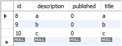
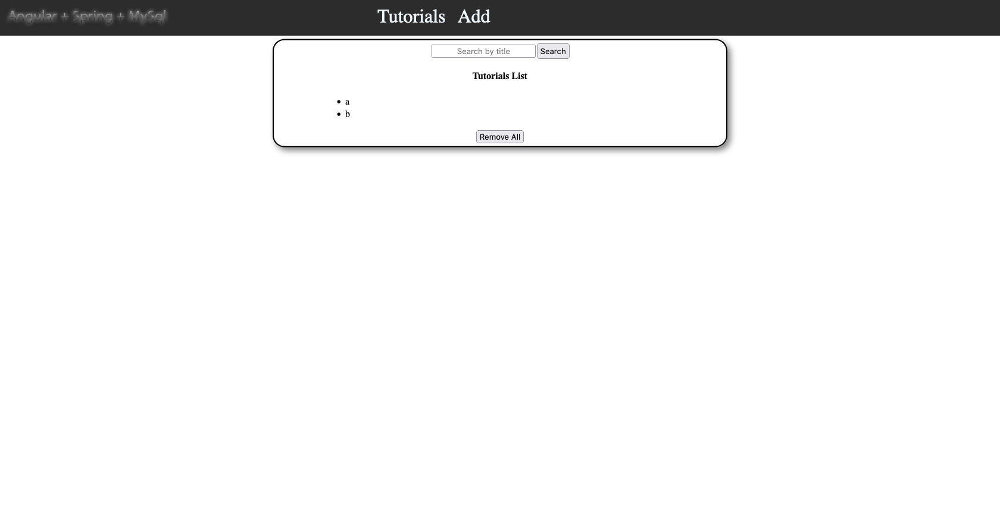
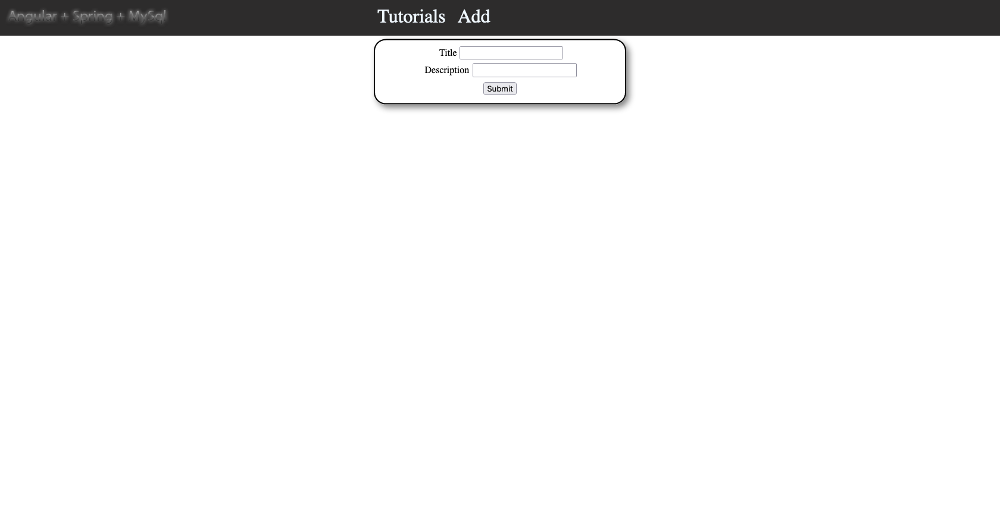
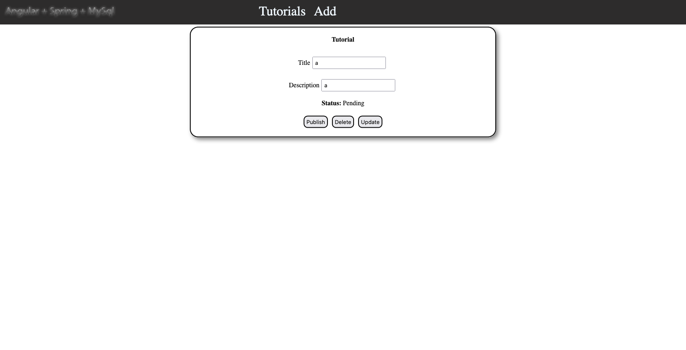
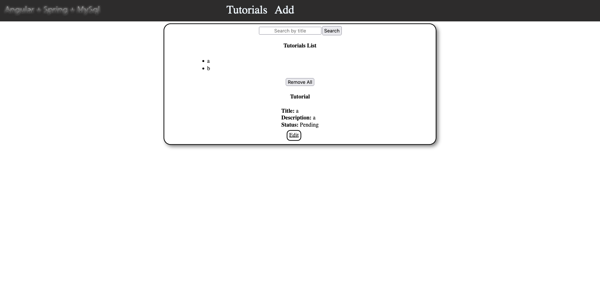
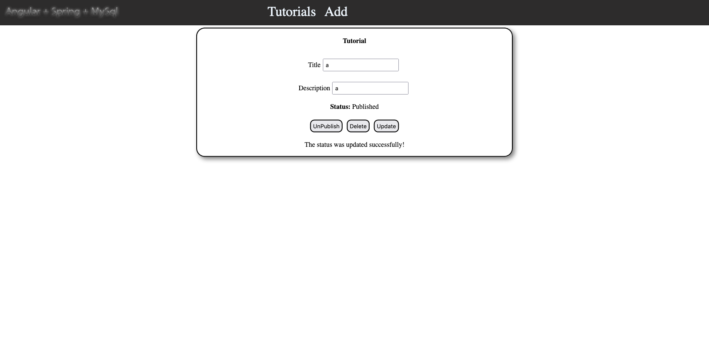

# Angular Spring Mysql

## Back-End

* 

### STRUCTURE:
* CONTROLLER  
  @GetMapping  
  @PostMapping  
  @PutMapping  
  @PatchMapping  
  @DeleteMapping  
  @RequestMapping
* ENTITIES  
  Representing the table from database with information. (structure)
* REPOSITORIES  
  Is used for create connection between entity and database.
## Front-End

